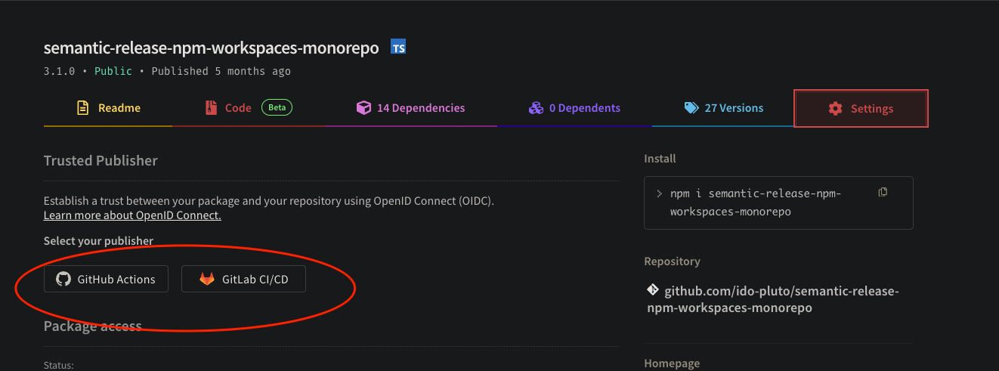
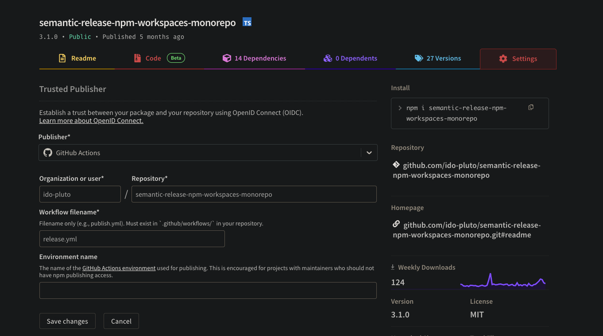
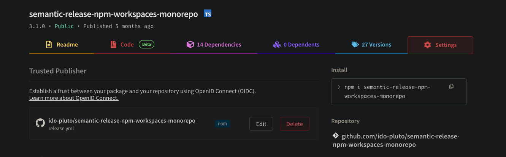

# Semantic Release with NPM Workspaces

Simplify the process of releasing a monorepo with npm workspaces.

Work with:

- Npm workspaces
- Bun workspaces
- Yarn workspaces
- Pnpm workspaces

> Only publish packages that changed.

# Installation

```bash
npm install --save-dev semantic-release-npm-workspaces-monorepo
```

# Usage

Add this to your `package.json` of your workspace root:

```json
{
  "workspaces": [
    "packages/*"
  ],
  "workspaceRelease": {
    "npmRelease": true,
    "release": {
      // semantic-release configuration
    }
  },
  "scripts": {
    "release": "semantic-release-npm-workspaces-monorepo"
  }
}
```

The default configuration of this package is:

```js
settings = {
    preReleaseVersionTemplate: false, // example: '${version}', override the template in the package.json for pre-release versions
    registry: 'https://registry.npmjs.org',
    tagFormat: '${name}@${version}',
    release: {
        extends: 'semantic-release-commit-filter',
        ci: true,
        branches: [
            "main", 
            "master",
            {
                name: "beta",
                prerelease: true
            }
        ],
        plugins: [...]
    },
    semanticReleaseBin: 'semantic-release',
    semanticReleaseBinArgs: [],

    // semantic-release pre-configured plugins
    changelogCommit: true, // create & update CHANGELOG.md
    npmRelease: false, // use NPM_TOKEN or OIDC to publish packages
    extendsReleaseRules: [], // extend defaults release rules
    extendsNoteGeneratorTypes: [], // extend defaults note generator types
    extendsDefaultPlugins: [], // add custom plugins additonally to the pre-configured plugins
}
```

### How it works

- It will update all the workspace (local dependencies) to the latest version from the registry before running semantic release, respecting configured release channels. When working in a prerelease branch (e.g., beta), it will fetch the latest prerelease version from that channel if available.
- It will do it by the dependency graph, meaning that it will update the packages in the correct order.
- Use `semantic-release-commit-filter` to filter the commits to only publish packages that changed.

### Pre-configured plugins

If you do not specify the `plugins` property in the `release` object, it will use the following plugins:

- @semantic-release/commit-analyzer
- @semantic-release/release-notes-generator
- @semantic-release/changelog (if `changelogCommit` is set true)
- @semantic-release/npm (if `npmRelease` is set true)
- @semantic-release/github (if `changelogCommit` is set true)
- @semantic-release/git (if `changelogCommit` is set true)

The plugins configure with recommended settings.
Checkout `settings.ts` for more information.

## Per Package Configuration
If you need the flexibility to configure some packages separately, you can use the `perPackageConfig` object within the `workspaceRelease` object.

```json
{
  "workspaces": [
    "packages/*"
  ],
  "workspaceRelease": {
    "npmRelease": true,

    "perPackageConfig": {
      "packages/internal/**": {
        // override specific configuration
        "npmRelease": false
      }
    }
  },
  "scripts": {
    "release": "semantic-release-npm-workspaces-monorepo"
  }
}
```

## Examples

Some examples of how to use this package:

- [npm-workspaces-example](https://github.com/ido-pluto/semantic-release-npm-workspaces-monorepo-example)
- [withastro-utils/utils](https://github.com/withastro-utils/utils)

## How to "Breaking Changes"?

The release of breaking changes can be confusing sometimes.

You need to write a commit message with `BREAKING CHANGE` in the footer of the commit to trigger a major release.

(You cannot use `BREAKING CHANGE` as the type)

```bash
git commit -m "feat: add new feature
BREAKING CHANGE: this is a breaking change"
```

To ease the process, you can use the `breaking` type in the commit message to trigger a major release in one line.

```bash
git commit -m "breaking: this is a breaking change"
```


## OIDC

This is the new way of auto publish packages to NPM.
You only need to connect the repo to NPM through NPM's UI.

Go to your package settings


Configure the connection


Done!

